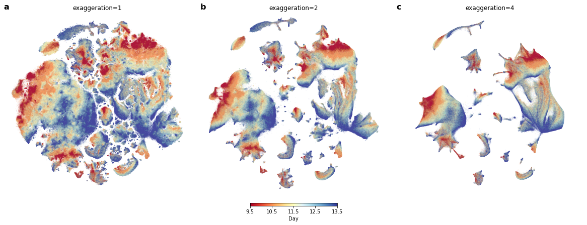

# openTSNE

This repository contains all the materials used in "*openTSNE: a modular Python library for t-SNE dimensionality reduction and embedding*". The actual *openTSNE* library can be found at https://github.com/pavlin-policar/opentsne

## Reproducibility

- `figures/` includes the scripts and environment details necessary to reproduce the figures from the manuscript.
- `benchmarks/` includes scripts to re-run the end-to-end benchmarks and generate the corresponding figures.
- `paper/` contains the manucript LaTeX files.