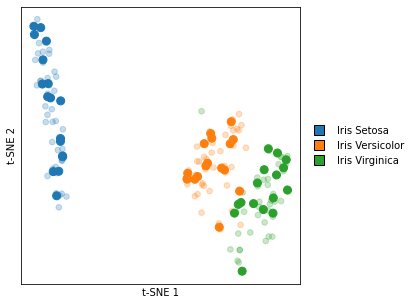

# Figures

To reproduce the figures shown in the manuscript run the following scripts.

## Download data

To download the raw data files and apply the same preprocessing techniques, run

```bash
bash generate_h5ad.sh
```

This script generates `.h5ad` files, which are much easier (and faster) to work with. However, generating these fiels can take a very long time, so we have uploaded the already prepared `.h5ad` files to `file.biolab.si/opentsne`. To download the required files, run

```bash
bash download_h5ad.sh
```

## Generate figures

Once you have obtained the preprocessed `.h5ad` files, you can replicate all the figures from the manuscript (excluding benchmarks) by running

```bash
bash generate_figures.sh
```

We also include exact conda environments and installed package versions.

## Scripts

### `fig1-macosko.py`


### `fig3-iris.py`




### `fig5-tasic.py`


### `fig6-cao.py`


### `fig7-hocherner.py`


